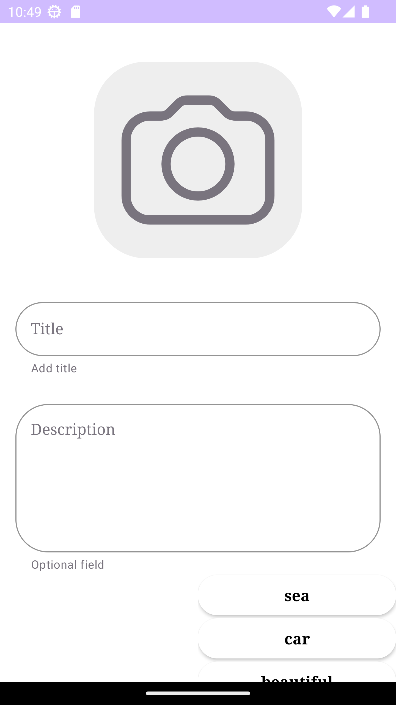

# GalleryApp

This is a basic gallery app for storing photos and adding tags to them.
Allows you to upload photos from local storage or the internet, tag photos and search by tag/some tags.
Written using Kotlin, Room for database, Koin for Dependency Injections, Ambilwarna for picking color dialog.

# Features
- MVVM architecture pattern
- Clean Architecture
- Storing images using Room database
- Used by Retrofit to work with Flickr API

# Gallery

<li>
  No images
</li>
<li>
  
</li>
<li>
  Creating image 1
</li>
<li>
  
</li>
<li>
 Creating image 2
</li>
<li>
  
</li>
<li>
  Created
</li>
<li>
  
</li>
<li>
  Second Image creating
</li>
<li>
  
</li>
<li>
  Created
</li>
<li>
  
</li>
<li>
  Adding "sea" tag
</li>
<li>
  
</li>
<li>
  Afted "sea" tag added
</li>
<li>
  
</li>
<li>
  Adding "my" tag
</li>
<li>
  
</li>
<li>
  Afted "my" tag added
</li>
<li>
  
</li>
